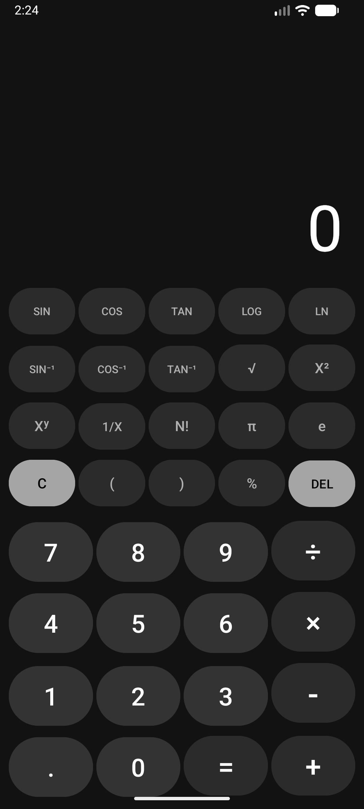

# Scientific-Calculator-using-JAVA-and-XML

# Scientific Calculator using JAVA and XML 📱

A robust, professional-grade Android scientific calculator built natively. This application features a custom-built mathematical expression parser capable of handling complex string-based equations without relying on external evaluation libraries.

## ✨ Features
* **Standard Operations:** Addition, Subtraction, Multiplication, Division, and Percentages (`%`).
* **Trigonometry:** `SIN`, `COS`, `TAN` (Calculated in Degrees).
* **Inverse Trigonometry:** `SIN⁻¹`, `COS⁻¹`, `TAN⁻¹`.
* **Advanced Mathematics:** Factorials (`N!`), Square Roots (`√`), Exponents (`X²`, `Xʸ`), Inverses (`1/X`), Logarithms (`LOG`, `LN`).
* **Constants:** Pi (`π`) and Euler's Number (`e`).
* **Custom Parser:** Safely parses and evaluates nested parentheses and order of operations using a recursive descent parsing algorithm written purely in Java.
* **Modern UI:** Sleek, high-contrast dark mode interface inspired by flagship native calculators.

## 📸 Screenshots
<p align="center">
  
</p>

## 🚀 How to Install

### Option 1: Quick Install (APK)
You can install and use the calculator right now on your Android device!
1. Go to the **[Releases](https://github.com/SarafatAlamIrfan/Scientific-Calculator-using-JAVA-and-XML/releases)** tab of this repository.
2. Download the `app-debug.apk` file to your Android phone.
3. Open the file and tap **Install** (you may need to allow "Install from Unknown Sources" in your device settings).

### Option 2: Build from Source (For Developers)
1. Clone the repository to your local machine: 
   ```bash
   git clone [https://github.com/SarafatAlamIrfan/Scientific-Calculator-using-JAVA-and-XML.git](https://github.com/SarafatAlamIrfan/Scientific-Calculator-using-JAVA-and-XML.git)

2. Open the project folder in Android Studio.

3. Let Gradle sync and build the project.

4. Run on an Android Emulator or a physical device.

### 🛠️ Tech Stack
Language: Java

UI Layout: XML (GridLayout, LinearLayout)

Environment: Android Studio

Minimum SDK: API 21+
